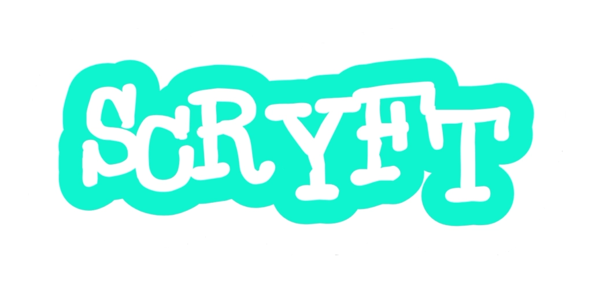

  

<h1 align="center">Scryft</h1>

  <b>The level-up for block coding.</b> 
  A modern, block-based game engine built for developers who have outgrown Scratch.

  
  
  
  

---

## What is Scryft?

Scryft is a block-based game engine designed as the next step after Scratch.

It keeps the visual, drag-and-drop coding style, but is being built to support:
- More advanced logic systems  
- Better structure for larger projects  
- Improved performance  
- A smoother transition into real-world game development  

The goal is to bridge the gap between beginner tools and full game engines—without forcing users straight into text-based coding.

---

## Current Status

Scryft is in **very early development**.

- The editor has **been built,** but its not **finished yet.**
- Core systems are still being designed
- Features and direction may change

This is the foundation stage of the project.

---

## Links

- 🌐 Website: https://scryft.github.io  
- 🧩 GitHub Organization: https://github.com/scryft  

---

## Contributing

We’re looking for developers who want to help build Scryft from the ground up.

  

### Requirements
- HTML  
- JavaScript  
- Experience with Blockly (or similar) is a plus  

### How to contribute
- Open an issue  
- Submit a pull request  
- Share your past work and what you want to help with  

---

## Vision

Scryft aims to answer a simple question:

> What comes after Scratch?

Not a toy, not overly complex—just the right next step.

---

## Roadmap (Early)

- [ ] Core architecture planning  
- [ ] Block system design (Blockly integration)  
- [ ] Editor prototype  
- [ ] Rendering system  
- [ ] Project saving/loading  
- [ ] First playable demo  

---

## License

This project is licensed under the MIT License.  
See the [LICENSE](LICENSE) file for details.
